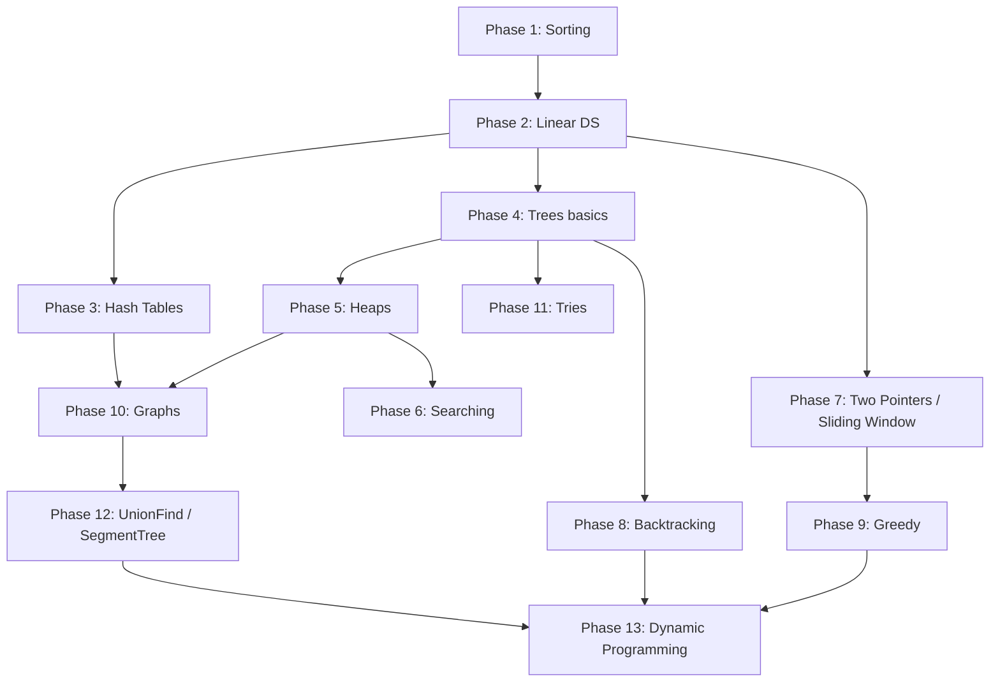

# Learning Roadmap

A phased plan for working through everything in `src/algotest/`. Each phase only depends on what was finished in earlier phases — no forward references.

Use the checkboxes to track progress.

## Phase 1 — Sorting (start here)

Folder: [sorting/](./sorting)

- [ ] [BubbleSort.js](./sorting/BubbleSort.js) — comparison + swap mechanics
- [ ] [SelectionSort.js](./sorting/SelectionSort.js) — in-place selection
- [ ] [InsertionSort.js](./sorting/InsertionSort.js) — partial sortedness, basis for TimSort
- [ ] [MergeSort.js](./sorting/MergeSort.js) — first taste of recursion + divide-and-conquer
- [ ] [QuickSort.js](./sorting/QuickSort.js) — partitioning, pivot strategies, randomization
- [ ] [HeapSort.js](./sorting/HeapSort.js) — uses heap intuition (deepens in Phase 5)
- [ ] [CountingSort.js](./sorting/CountingSort.js) — non-comparison sort, integer key range
- [ ] [RadixSort.js](./sorting/RadixSort.js) — multi-pass non-comparison, builds on Counting

**By the end:** comfortable with recursion, in-place vs. out-of-place, stability, time/space trade-offs.

## Phase 2 — Linear data structures

Folders: [linkedLists/](./dataStructures/linkedLists), [stacksQueues/](./dataStructures/stacksQueues)

- [ ] Singly Linked List — insert / delete / reverse / cycle detection
- [ ] Doubly Linked List — used in `LRUCache` later
- [ ] Stack — LIFO (paren matching, monotonic stack patterns)
- [ ] Queue — FIFO (BFS in Phase 10 depends on this)
- [ ] Deque — both ends

**Skill goal:** pointer manipulation without re-creating arrays.

## Phase 3 — Hash tables

Folder: [hashTables/](./dataStructures/hashTables)

- [ ] [HashTable.js](./dataStructures/hashTables/HashTable.js) — hashing + collision strategies (chaining / open addressing)
- [ ] [LRUCache.js](./dataStructures/hashTables/LRUCache.js) — combines HashTable + Doubly Linked List (Phase 2 payoff)

**Skill goal:** O(1) lookup intuition, the workhorse of interview problems.

## Phase 4 — Trees (basics)

Folder: [trees/](./dataStructures/trees) — only the basic files for now

- [ ] [TreeTraversals.js](./dataStructures/trees/TreeTraversals.js) — pre/in/post-order recursive + iterative + level-order BFS
- [ ] [BinarySearchTree.js](./dataStructures/trees/BinarySearchTree.js) — insert / find / contains / delete

**Skill goal:** recursion on tree shapes, stacking call frames.

## Phase 5 — Heaps

Folder: [heaps/](./dataStructures/heaps)

- [ ] [Heap.js](./dataStructures/heaps/Heap.js) — MinHeap, MaxHeap, PriorityQueue
- [ ] Re-derive `HeapSort` from Phase 1 — should now feel obvious

## Phase 6 — Searching

Folder: [algorithms/searching/](./algorithms/searching)

- [ ] [BinarySearch.js](./algorithms/searching/BinarySearch.js) — plus variants: first occurrence, last occurrence, rotated array, peak element

Practice the "find boundary" pattern.

## Phase 7 — Two Pointers and Sliding Window

Folders: [algorithms/twoPointers/](./algorithms/twoPointers), [algorithms/slidingWindow/](./algorithms/slidingWindow)

- [ ] Two Pointers — twoSum / threeSum, palindrome check, trap rain water
- [ ] Sliding Window — fixed-size and variable-size, longest substring, min window

Sliding window is two pointers with state, so do them back-to-back.

## Phase 8 — Backtracking

Folder: [algorithms/backtracking/](./algorithms/backtracking)

- [ ] Permutations, subsets
- [ ] Combination sum
- [ ] N-Queens, Sudoku

Requires comfort with recursion (Phases 1, 4) and stack thinking (Phase 2).

## Phase 9 — Greedy

Folder: [algorithms/greedy/](./algorithms/greedy)

- [ ] Activity selection, interval scheduling
- [ ] Huffman coding
- [ ] Fractional knapsack

Mental warm-up for DP — same setup, different (often simpler) decision rule.

## Phase 10 — Graphs

Folders: [dataStructures/graphs/](./dataStructures/graphs), [algorithms/graphs/](./algorithms/graphs)

- [ ] [Graph.js](./dataStructures/graphs/Graph.js) — adjacency list representation
- [ ] BFS / DFS (typically inside `Graph.js`)
- [ ] [Dijkstra.js](./algorithms/graphs/Dijkstra.js) — shortest path; uses PriorityQueue from Phase 5
- [ ] [TopologicalSort.js](./algorithms/graphs/TopologicalSort.js) — DAG ordering; uses Stack/Queue from Phase 2

## Phase 11 — Tries

Folder: [tries/](./dataStructures/tries)

- [ ] [Trie.js](./dataStructures/tries/Trie.js) — prefix tree for autocomplete / word-search problems

## Phase 12 — Specialized structures

Folders: [unionFind/](./dataStructures/unionFind), [trees/SegmentTree.js](./dataStructures/trees/SegmentTree.js)

- [ ] [UnionFind.js](./dataStructures/unionFind/UnionFind.js) — connectivity, Kruskal-style problems
- [ ] [SegmentTree.js](./dataStructures/trees/SegmentTree.js) — range queries / range updates

## Phase 13 — Dynamic Programming (last)

Folder: [algorithms/dynamicProgramming/](./algorithms/dynamicProgramming)

DP needs everything above: recursion, memoization, tabulation, and pattern recognition.

- [ ] 1D DP — Fibonacci, climbing stairs, house robber
- [ ] [Knapsack.js](./algorithms/dynamicProgramming/Knapsack.js) — 0/1, fractional, unbounded
- [ ] [LCS.js](./algorithms/dynamicProgramming/LCS.js) — Longest Common Subsequence, edit distance
- [ ] Grid DP, interval DP, bitmask DP

## Continuous track (parallel to all phases)

- [frequent/](./frequent) — drill `iterations.js`, `infiniteCurrying.js`, `regexp.js` weekly. JS fluency compounds.
- [problems/easy/](./problems/easy) and [problems/medium/](./problems/medium) — solve a couple per phase to validate concepts on real interview-style problems.

## Dependency map

## Time-frame guidance (rough)

At 1 hour/day, 5 days/week:

| Group | Phases | Estimate |
| --- | --- | --- |
| Foundations | 1 to 5 | ~5 weeks |
| Techniques | 6 to 9 | ~3 weeks |
| Graphs + specialized | 10 to 12 | ~3 weeks |
| Dynamic Programming | 13 | ~3 to 4 weeks |
| **Total** | | **~14 to 16 weeks** |
